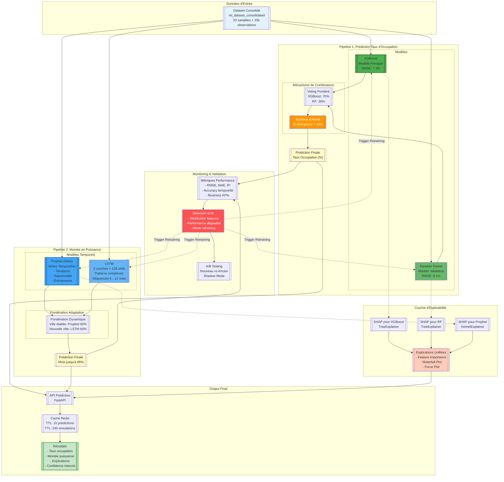

```mermaid
graph TB
    subgraph "Données d'Entrée"
        INPUT[["Dataset Consolidé<br/>ml_dataset_consolidated<br/>33 variables × 15k observations"]]
    end
    
    subgraph "Pipeline 1: Prédiction Taux d'Occupation"
        subgraph "Modèles"
            XGB[["XGBoost<br/>Modèle Principal<br/>RMSE: 7.3%"]]
            RF[["Random Forest<br/>Modèle Validation<br/>RMSE: 8.1%"]]
        end
        
        subgraph "Mécanisme de Combinaison"
            VOTE[["Voting Pondéré<br/>XGBoost: 70%<br/>RF: 30%"]]
            ALERT[["Système d'Alerte<br/>Si divergence > 10%"]]
        end
        
        PRED1[["Prédiction Finale<br/>Taux Occupation (%)"]]
    end
    
    subgraph "Pipeline 2: Montée en Puissance"
        subgraph "Modèles Temporels"
            PROPHET[["Prophet (Meta)<br/>Séries Temporelles<br/>- Tendance<br/>- Saisonnalité<br/>- Événements"]]
            LSTM[["LSTM<br/>2 couches × 128 units<br/>Patterns complexes<br/>Séquences 6→12 mois"]]
        end
        
        subgraph "Pondération Adaptative"
            WEIGHT[["Pondération Dynamique<br/>Ville établie: Prophet 60%<br/>Nouvelle ville: LSTM 60%"]]
        end
        
        PRED2[["Prédiction Finale<br/>Mois jusqu'à 85%"]]
    end
    
    subgraph "Couche d'Explicabilité"
        SHAP_XGB[["SHAP pour XGBoost<br/>TreeExplainer"]]
        SHAP_RF[["SHAP pour RF<br/>TreeExplainer"]]
        SHAP_PROPHET[["SHAP pour Prophet<br/>KernelExplainer"]]
        
        EXPLAIN[["Explications Unifiées<br/>- Feature Importance<br/>- Waterfall Plot<br/>- Force Plot"]]
    end
    
    subgraph "Monitoring & Validation"
        METRICS[["Métriques Performance<br/>- RMSE, MAE, R²<br/>- Accuracy temporelle<br/>- Business KPIs"]]
        DRIFT[["Détection Drift<br/>- Distribution features<br/>- Performance dégradée<br/>- Alerte retraining"]]
        AB[["A/B Testing<br/>Nouveau vs Ancien<br/>Shadow Mode"]]
    end
    
    subgraph "Output Final"
        API[["API Prédiction<br/>FastAPI"]]
        CACHE[["Cache Redis<br/>TTL: 1h prédictions<br/>TTL: 24h simulations"]]
        RESULT[["Résultats<br/>- Taux occupation<br/>- Montée puissance<br/>- Explications<br/>- Confidence interval"]]
    end
    
    %% Flux de données Pipeline 1
    INPUT --> XGB
    INPUT --> RF
    XGB --> VOTE
    RF --> VOTE
    VOTE --> ALERT
    ALERT --> PRED1
    
    %% Flux de données Pipeline 2
    INPUT --> PROPHET
    INPUT --> LSTM
    PROPHET --> WEIGHT
    LSTM --> WEIGHT
    WEIGHT --> PRED2
    
    %% Connexions Explicabilité
    XGB -.-> SHAP_XGB
    RF -.-> SHAP_RF
    PROPHET -.-> SHAP_PROPHET
    SHAP_XGB --> EXPLAIN
    SHAP_RF --> EXPLAIN
    SHAP_PROPHET --> EXPLAIN
    
    %% Connexions Monitoring
    PRED1 --> METRICS
    PRED2 --> METRICS
    METRICS --> DRIFT
    DRIFT --> AB
    
    %% Output
    PRED1 --> API
    PRED2 --> API
    EXPLAIN --> API
    API --> CACHE
    CACHE --> RESULT
    
    %% Feedback loops
    DRIFT -.->|"Trigger Retraining"| XGB
    DRIFT -.->|"Trigger Retraining"| RF
    DRIFT -.->|"Trigger Retraining"| PROPHET
    DRIFT -.->|"Trigger Retraining"| LSTM
    
    style INPUT fill:#e3f2fd
    style XGB fill:#4caf50,stroke:#2e7d32,stroke-width:3px
    style RF fill:#66bb6a
    style PROPHET fill:#42a5f5,stroke:#1976d2,stroke-width:3px
    style LSTM fill:#64b5f6
    style PRED1 fill:#fff9c4
    style PRED2 fill:#fff9c4
    style EXPLAIN fill:#ffccbc
    style RESULT fill:#c8e6c9,stroke:#4caf50,stroke-width:3px
    style ALERT fill:#ff9800,color:#fff
    style DRIFT fill:#ff5252,color:#fff
```
