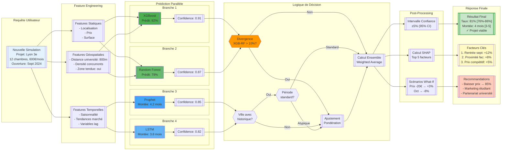

```mermaid
graph LR
    subgraph "Requête Utilisateur"
        REQ[["Nouvelle Simulation<br/>Projet: Lyon 3e<br/>12 chambres, 600€/mois<br/>Ouverture: Sept 2024"]]
    end
    
    subgraph "Feature Engineering"
        FE1[["Features Statiques<br/>- Localisation<br/>- Prix<br/>- Surface"]]
        FE2[["Features Temporelles<br/>- Saisonnalité<br/>- Tendances marché<br/>- Variables lag"]]
        FE3[["Features Géospatiales<br/>- Distance université: 800m<br/>- Densité concurrents<br/>- Zone tendue: oui"]]
    end
    
    subgraph "Prédiction Parallèle"
        subgraph "Branche 1"
            M1[["XGBoost<br/>Prédit: 82%"]]
            C1[["Confidence: 0.91"]]
        end
        
        subgraph "Branche 2"
            M2[["Random Forest<br/>Prédit: 79%"]]
            C2[["Confidence: 0.87"]]
        end
        
        subgraph "Branche 3"
            M3[["Prophet<br/>Montée: 4.2 mois"]]
            C3[["Confidence: 0.85"]]
        end
        
        subgraph "Branche 4"
            M4[["LSTM<br/>Montée: 3.8 mois"]]
            C4[["Confidence: 0.82"]]
        end
    end
    
    subgraph "Logique de Décision"
        CHECK1{{"Divergence<br/>XGB-RF > 10%?"}}
        CHECK2{{"Ville avec<br/>historique?"}}
        CHECK3{{"Période<br/>standard?"}}
        
        ENSEMBLE[["Calcul Ensemble<br/>Weighted Average"]]
        ADJUST[["Ajustement<br/>Pondération"]]
    end
    
    subgraph "Post-Processing"
        INTERVAL[["Intervalle Confiance<br/>±5% (95% CI)"]]
        SHAP_CALC[["Calcul SHAP<br/>Top 5 facteurs"]]
        SCENARIO[["Scénarios What-If<br/>Prix -20€ → +3%<br/>Oct → -8%"]]
    end
    
    subgraph "Réponse Finale"
        RESPONSE[["Résultat Final<br/>Taux: 81% [76%-86%]<br/>Montée: 4 mois [3-5]<br/>✓ Projet viable"]]
        FACTORS[["Facteurs Clés<br/>1. Rentrée sept: +12%<br/>2. Proximité fac: +8%<br/>3. Prix compétitif: +5%"]]
        RECO[["Recommandations<br/>- Baisser prix → 85%<br/>- Marketing étudiant<br/>- Partenariat université"]]
    end
    
    REQ --> FE1
    REQ --> FE2
    REQ --> FE3
    
    FE1 --> M1
    FE1 --> M2
    FE2 --> M3
    FE2 --> M4
    FE3 --> M1
    FE3 --> M2
    
    M1 --> C1
    M2 --> C2
    M3 --> C3
    M4 --> C4
    
    C1 --> CHECK1
    C2 --> CHECK1
    
    CHECK1 -->|"Non"| ENSEMBLE
    CHECK1 -->|"Oui"| ADJUST
    
    C3 --> CHECK2
    C4 --> CHECK2
    
    CHECK2 -->|"Oui"| CHECK3
    CHECK2 -->|"Non"| ADJUST
    
    CHECK3 -->|"Standard"| ENSEMBLE
    CHECK3 -->|"Atypique"| ADJUST
    
    ADJUST --> ENSEMBLE
    
    ENSEMBLE --> INTERVAL
    ENSEMBLE --> SHAP_CALC
    ENSEMBLE --> SCENARIO
    
    INTERVAL --> RESPONSE
    SHAP_CALC --> FACTORS
    SCENARIO --> RECO
    
    style REQ fill:#e3f2fd
    style M1 fill:#4caf50
    style M2 fill:#66bb6a
    style M3 fill:#42a5f5
    style M4 fill:#64b5f6
    style CHECK1 fill:#ff9800
    style RESPONSE fill:#c8e6c9,stroke:#4caf50,stroke-width:3px
    style FACTORS fill:#fff9c4
    style RECO fill:#ffccbc
```
