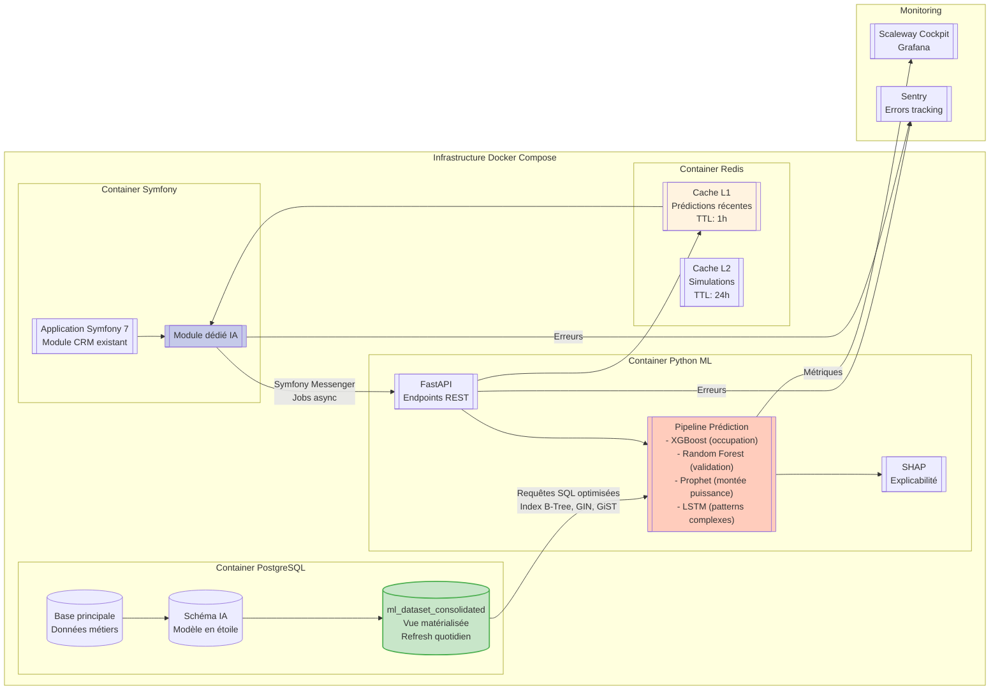

```mermaid
graph LR
    subgraph "Infrastructure Docker Compose"
        subgraph "Container Symfony"
            A1[["Application Symfony 7<br/>Module CRM existant"]]
            A2[["Module dédié IA"]]
        end
        
        subgraph "Container PostgreSQL"
            B1[("Base principale<br/>Données métiers")]
            B2[("Schéma IA<br/>Modèle en étoile")]
            B3[("ml_dataset_consolidated<br/>Vue matérialisée<br/>Refresh quotidien")]
        end
        
        subgraph "Container Python ML"
            C1[["FastAPI<br/>Endpoints REST"]]
            C2[["Pipeline Prédiction<br/>- XGBoost (occupation)<br/>- Random Forest (validation)<br/>- Prophet (montée puissance)<br/>- LSTM (patterns complexes)"]]
            C3[["SHAP<br/>Explicabilité"]]
        end
        
        subgraph "Container Redis"
            D1[["Cache L1<br/>Prédictions récentes<br/>TTL: 1h"]]
            D2[["Cache L2<br/>Simulations<br/>TTL: 24h"]]
        end
    end
    
    subgraph "Monitoring"
        E1[["Scaleway Cockpit<br/>Grafana"]]
        E2[["Sentry<br/>Errors tracking"]]
    end
    
    B1 --> B2
    B2 --> B3
    
    A1 --> A2
    A2 -->|"Symfony Messenger<br/>Jobs async"| C1
    
    B3 -->|"Requêtes SQL optimisées<br/>Index B-Tree, GIN, GiST"| C2
    
    C1 --> C2
    C2 --> C3
    
    C1 --> D1
    D1 --> A2
    
    C2 -->|"Métriques"| E1
    A2 -->|"Erreurs"| E2
    C1 -->|"Erreurs"| E2
    
    style A2 fill:#c5cae9
    style B3 fill:#c8e6c9,stroke:#4caf50,stroke-width:2px
    style C2 fill:#ffccbc
    style D1 fill:#fff3e0
```
