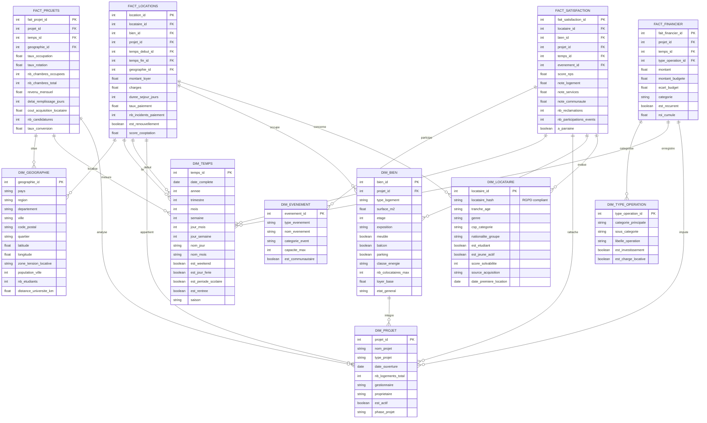

```mermaid
erDiagram
    %% Tables de faits
    FACT_LOCATIONS {
        int location_id PK
        int locataire_id FK
        int bien_id FK
        int projet_id FK
        int temps_debut_id FK
        int temps_fin_id FK
        int geographie_id FK
        float montant_loyer
        float charges
        int duree_sejour_jours
        float taux_paiement
        int nb_incidents_paiement
        boolean est_renouvellement
        float score_cooptation
    }
    
    FACT_PROJETS {
        int fait_projet_id PK
        int projet_id FK
        int temps_id FK
        int geographie_id FK
        float taux_occupation
        float taux_rotation
        int nb_chambres_occupees
        int nb_chambres_total
        float revenu_mensuel
        int delai_remplissage_jours
        float cout_acquisition_locataire
        int nb_candidatures
        float taux_conversion
    }
    
    FACT_FINANCIER {
        int fait_financier_id PK
        int projet_id FK
        int temps_id FK
        int type_operation_id FK
        float montant
        float montant_budgete
        float ecart_budget
        string categorie
        boolean est_recurrent
        float roi_cumule
    }
    
    FACT_SATISFACTION {
        int fait_satisfaction_id PK
        int locataire_id FK
        int bien_id FK
        int projet_id FK
        int temps_id FK
        int evenement_id FK
        float score_nps
        float note_logement
        float note_services
        float note_communaute
        int nb_reclamations
        int nb_participations_events
        boolean a_parraine
    }
    
    %% Dimensions communes
    DIM_TEMPS {
        int temps_id PK
        date date_complete
        int annee
        int trimestre
        int mois
        int semaine
        int jour_mois
        int jour_semaine
        string nom_jour
        string nom_mois
        boolean est_weekend
        boolean est_jour_ferie
        boolean est_periode_scolaire
        boolean est_rentree
        string saison
    }
    
    DIM_GEOGRAPHIE {
        int geographie_id PK
        string pays
        string region
        string departement
        string ville
        string code_postal
        string quartier
        float latitude
        float longitude
        string zone_tension_locative
        int population_ville
        int nb_etudiants
        float distance_universite_km
    }
    
    DIM_LOCATAIRE {
        int locataire_id PK
        string locataire_hash "RGPD compliant"
        string tranche_age
        string genre
        string csp_categorie
        string nationalite_groupe
        boolean est_etudiant
        boolean est_jeune_actif
        int score_solvabilite
        string source_acquisition
        date date_premiere_location
    }
    
    DIM_BIEN {
        int bien_id PK
        int projet_id FK
        string type_logement
        float surface_m2
        int etage
        string exposition
        boolean meuble
        boolean balcon
        boolean parking
        string classe_energie
        int nb_colocataires_max
        float loyer_base
        string etat_general
    }
    
    %% Dimensions supplémentaires
    DIM_PROJET {
        int projet_id PK
        string nom_projet
        string type_projet
        date date_ouverture
        int nb_logements_total
        string gestionnaire
        string proprietaire
        boolean est_actif
        string phase_projet
    }
    
    DIM_TYPE_OPERATION {
        int type_operation_id PK
        string categorie_principale
        string sous_categorie
        string libelle_operation
        boolean est_investissement
        boolean est_charge_locative
    }
    
    DIM_EVENEMENT {
        int evenement_id PK
        string type_evenement
        string nom_evenement
        string categorie_event
        int capacite_max
        boolean est_communautaire
    }
    
    %% Relations
    FACT_LOCATIONS ||--o{ DIM_LOCATAIRE : "concerne"
    FACT_LOCATIONS ||--o{ DIM_BIEN : "occupe"
    FACT_LOCATIONS ||--o{ DIM_PROJET : "appartient"
    FACT_LOCATIONS ||--o{ DIM_TEMPS : "debut"
    FACT_LOCATIONS ||--o{ DIM_TEMPS : "fin"
    FACT_LOCATIONS ||--o{ DIM_GEOGRAPHIE : "localise"
    
    FACT_PROJETS ||--o{ DIM_PROJET : "analyse"
    FACT_PROJETS ||--o{ DIM_TEMPS : "mesure"
    FACT_PROJETS ||--o{ DIM_GEOGRAPHIE : "situe"
    
    FACT_FINANCIER ||--o{ DIM_PROJET : "impute"
    FACT_FINANCIER ||--o{ DIM_TEMPS : "enregistre"
    FACT_FINANCIER ||--o{ DIM_TYPE_OPERATION : "categorise"
    
    FACT_SATISFACTION ||--o{ DIM_LOCATAIRE : "evalue"
    FACT_SATISFACTION ||--o{ DIM_BIEN : "note"
    FACT_SATISFACTION ||--o{ DIM_PROJET : "rattache"
    FACT_SATISFACTION ||--o{ DIM_TEMPS : "date"
    FACT_SATISFACTION ||--o{ DIM_EVENEMENT : "participe"
    
    DIM_BIEN ||--o{ DIM_PROJET : "integre"
```
