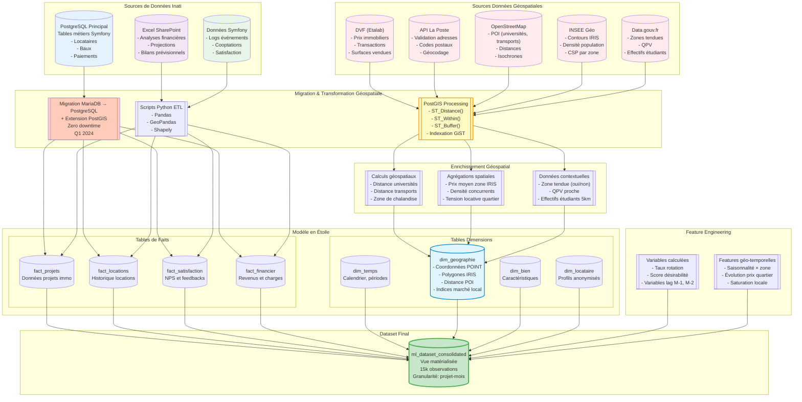

```mermaid
graph TB
    subgraph "Sources de Données Inati"
        A1[("PostgreSQL Principal<br/>Tables métiers Symfony<br/>- Locataires<br/>- Baux<br/>- Paiements")]
        A2[("Excel SharePoint<br/>- Analyses financières<br/>- Projections<br/>- Bilans prévisionnels")]
        A4[("Données Symfony<br/>- Logs événements<br/>- Cooptations<br/>- Satisfaction")]
    end
    
    subgraph "Sources Données Géospatiales"
        G1[("DVF (Etalab)<br/>- Prix immobiliers<br/>- Transactions<br/>- Surfaces vendues")]
        G2[("API La Poste<br/>- Validation adresses<br/>- Codes postaux<br/>- Géocodage")]
        G3[("OpenStreetMap<br/>- POI (universités, transports)<br/>- Distances<br/>- Isochrones")]
        G4[("INSEE Géo<br/>- Contours IRIS<br/>- Densité population<br/>- CSP par zone")]
        G5[("Data.gouv.fr<br/>- Zones tendues<br/>- QPV<br/>- Effectifs étudiants")]
    end
    
    subgraph "Migration & Transformation Géospatiale"
        B1[["Migration MariaDB → PostgreSQL<br/>+ Extension PostGIS<br/>Zero downtime<br/>Q1 2024"]]
        B2[["Scripts Python ETL<br/>- Pandas<br/>- GeoPandas<br/>- Shapely"]]
        B3[["PostGIS Processing<br/>- ST_Distance()<br/>- ST_Within()<br/>- ST_Buffer()<br/>- Indexation GiST"]]
    end
    
    subgraph "Enrichissement Géospatial"
        GE1[["Calculs géospatiaux<br/>- Distance universités<br/>- Distance transports<br/>- Zone de chalandise"]]
        GE2[["Agrégations spatiales<br/>- Prix moyen zone IRIS<br/>- Densité concurrents<br/>- Tension locative quartier"]]
        GE3[["Données contextuelles<br/>- Zone tendue (oui/non)<br/>- QPV proche<br/>- Effectifs étudiants 5km"]]
    end
    
    subgraph "Modèle en Étoile"
        subgraph "Tables de Faits"
            C1[("fact_projets<br/>Données projets immo")]
            C2[("fact_locations<br/>Historique locations")]
            C3[("fact_satisfaction<br/>NPS et feedbacks")]
            C4[("fact_financier<br/>Revenus et charges")]
        end
        
        subgraph "Tables Dimensions"
            D1[("dim_temps<br/>Calendrier, périodes")]
            D2[("dim_geographie<br/>- Coordonnées POINT<br/>- Polygones IRIS<br/>- Distance POI<br/>- Indices marché local")]
            D3[("dim_bien<br/>Caractéristiques")]
            D4[("dim_locataire<br/>Profils anonymisés")]
        end
    end
    
    subgraph "Feature Engineering"
        E1[["Variables calculées<br/>- Taux rotation<br/>- Score désirabilité<br/>- Variables lag M-1, M-2"]]
        E2[["Features géo-temporelles<br/>- Saisonnalité × zone<br/>- Évolution prix quartier<br/>- Saturation locale"]]
    end
    
    subgraph "Dataset Final"
        F1[("ml_dataset_consolidated<br/>Vue matérialisée<br/>15k observations<br/>Granularité: projet-mois")]
    end
    
    A1 --> B1
    A2 --> B2
    A4 --> B2
    
    G1 --> B3
    G2 --> B3
    G3 --> B3
    G4 --> B3
    G5 --> B3
    
    B1 --> C1
    B1 --> C2
    B1 --> C3
    B1 --> C4
    
    B2 --> C1
    B2 --> C2
    B2 --> C3
    B2 --> C4
    
    B3 --> GE1
    B3 --> GE2
    B3 --> GE3
    
    GE1 --> D2
    GE2 --> D2
    GE3 --> D2
    
    C1 --> F1
    C2 --> F1
    C3 --> F1
    C4 --> F1
    
    D1 --> F1
    D2 --> F1
    D3 --> F1
    D4 --> F1
    
    E1 --> F1
    E2 --> F1
    
    style A1 fill:#e3f2fd
    style A2 fill:#f3e5f5
    style A4 fill:#e8f5e9
    style G1 fill:#ffebee
    style G2 fill:#ffebee
    style G3 fill:#ffebee
    style G4 fill:#ffebee
    style G5 fill:#ffebee
    style B1 fill:#ffccbc
    style B3 fill:#fff9c4,stroke:#ff9800,stroke-width:2px
    style D2 fill:#e1f5fe,stroke:#0288d1,stroke-width:2px
    style F1 fill:#c8e6c9,stroke:#4caf50,stroke-width:3px
```
